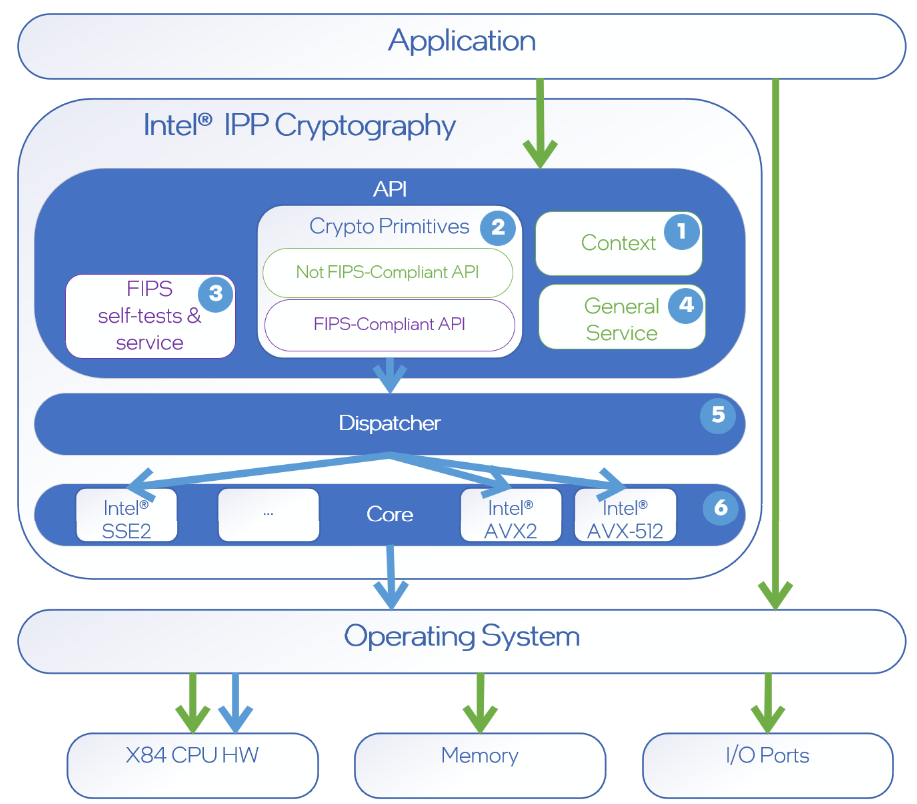

# Intel(R) Integrated Performance Primitives Cryptography (Intel(R) IPP Cryptography) FIPS

## What is FIPS 140?

FIPS (Federal Information Processing Standard) 140 series are U.S. government
computer security standards that specify requirements for cryptography modules.
The latest version is FIPS 140-3 (ISO standard 19790).

### Who needs FIPS 140?

The National Institute of Standards and Technology (NIST) issues the 140
Publication Series to coordinate the requirements and standards for
cryptographic modules which include HW, SW, and/or FW components for use by
**departments and agencies of the U.S. government**.
In U.S., government agencies desiring to deploy cryptographic modules should
confirm that the module they are using has a valid FIPS 140 certificate.
The Government of Canada also recommends the use of FIPS 140 validated
cryptographic modules in unclassified applications of its departments.
In addition, **in recent years FIPS 140 has become a more and more popular requirement in financial and health care sectors as well**.

## FIPS-Certified vs FIPS-Compliant

FIPS 140-3 defines 4 security levels (from level 1 - the easiest to level 4 - the most stringent).
In general, software may be certified at up to level 2.

Intel® Integrated Performance Primitives Cryptography (Intel(R) IPP Cryptography)
provides building blocks of FIPS-mode API (such as self-tests, FIPS-approved
functionality status query) which can help the end users to fullfill FIPS level 1 requirements.
Please, refer to [Covered Algorithms](#covered-algorithms) section for the full
list of FIPS-Approved API which are covered with the selftests.

> NOTE: Intel(R) IPP Cryptography is not **FIPS-Certified** on its own but **FIPS-Compliant**:
that means Intel(R) IPP Cryptography releases will have Cryptographic Algorithm
Validation Program (CAVP) testing and certification done but don't have full
Cryptographic Module Validation Program certificate as the context of the usage
of Intel(R) IPP Cryptography's high-performant primitives depends on a more high-level application.

For the results of CAVP testing please contact us via [Intel(R) Community](https://community.intel.com/t5/Intel-Integrated-Performance/bd-p/integrated-performance-primitives).

Intel(R) IPP Cryptography may be built in FIPS-mode with IPPCP_FIPS_MODE=on
configuration for ippcp and MBX_FIPS_MODE=on for crypto_MB (see details in [Build section](#build)).

Application, which uses Intel(R) IPP Cryptography may be **FIPS-Certified** by
matching FIPS 140 requirement and obtaining NIST sertificate or also be **FIPS-Compliant** for their own customers.

Please, refer to [Level 1 Specific Requirements](#level-1-specific-requirements)
for the detailed description of what is done on Intel(R) IPP Cryptography-side
and what should be done by a more high-level application.

### Level 1 Specific Requirements

| # | Requirement | Note |
|---|-------------|------|
| 1 |Provide service to output module's name / identifier and version to User | Intel(R) IPP Cryptography provides such functionality via ippcpGetLibVersion() API for IPPCP and mbx_getversion() API for crypto_MB |
| 2 |For every service, output to the user whether it is a FIPS-approved service or not | Intel(R) IPP Cryptography provides such functionality via [ippcp_is_fips_approved_func](#api-for-an-indicator-if-a-function-is-fips-approved) for ippcp and [mbx_is_fips_approved_func](#crypto-multi-buffer-library-api-for-an-indicator-if-a-function-is-fips-approved) for crypto_MB |
| 3 |Zeroize unprotected keys using manual/procedural destruction method | **User's application effort required** |
| 4 |Run integrity selftest at power on for SW component | **User's application effort required** |
| 5 | Run known-answer or comparison or fault-detection selftest for individual crypto algorithms before first use | Intel(R) IPP Cryptography provides [fips_selftest_ippcp<algorithm name> API](#covered-algorithms) to run selftests. User's application should call them before the first use of algorithm (see [Example](#example-of-api-usage)) |
| 6 | Run pairwise consistency selftest for newly generated RSA/ECC keypair | Intel(R) IPP Cryptography provides [fips_selftest_ippcp<algorithm name> API](#covered-algorithms) to run selftests |
| 7 | Module to guarantee uniqueness of GSM key + IV | **User's application effort required** |
| 8 | Module to guarantee XTS key1 != key2 | Intel(R) IPP Cryptography-side check |
| 9 | (non-production) Extract raw noise source output samples of RBG for quality analysis | DBRNG is currenty out of the cryptography boundary |
| 10| (non-production) Run crypto algorithm testing with NIST-generated vectors | Done offline by Intel(R) IPP Cryptography for the [covered algorithms](#covered-algorithms) |

For the implementation details about the steps in [Level 1 Specific Requirements](#level-1-specific-requirements)
specified as **User's application effort required** please refer to the
[Implementation Guidance for FIPS 140-3 and the Cryptographic Module Validation Program](https://csrc.nist.gov/csrc/media/Projects/cryptographic-module-validation-program/documents/fips%20140-3/FIPS%20140-3%20IG.pdf) by the National Institute of Standards and Technology.

## Cryptographic boundary

### Intel(R) IPP Cryptography Structure Diagram



1. Intel(R) IPP Cryptography Library uses special structures (Spec and States)
to store context information and provides service functions to work with context (e.g. Initialization).

> Note: Application responsible for the life-cycle of context. All memory allocations
and sanitizing happens on application side (including #3 in [Level 1 Specific Requirements](#level-1-specific-requirements)).

2. Cryptographic Algorithms API (both FIPS-Compliant and not FIPS Compliant).
3. FIPS Self-tests API and service to query if algorithm is FIPS-Compliant
(API for #2, #5, #6 in [Level 1 Specific Requirements](#level-1-specific-requirements)).
4. Version information (API for #1 in [Level 1 Specific Requirements](#level-1-specific-requirements)), Dispatcher control.
5. Intel(R) IPP Cryptography chooses the optimal code path depending on
hardware features and application settings (via Dispatcher control API).
6. The algorithms may have multiple code branches for different hardware
architecture and different compilation flags may be used to achieve better performance.

Refer to [Covered Algorithms](#covered-algorithms) section to check which
algorithms are within the cryptographic boundary.

> Note: For #10 in [Level 1 Specific Requirements](#level-1-specific-requirements)
Intel(R) IPP Cryptography tests all code-paths and algorithms modes as
the implementation may vary depending on the target hardware.

## Intel(R) IPP Cryptography Usage in the FIPS-mode

### Build

CMake flag -DIPPCP_FIPS_MODE:BOOL=on should be used to build ippcp library and
-DMBX_FIPS_MODE:BOOL=on for crypto_MB in FIPS-mode. These modes enable extra API for
self-tests and FIPS-support query (see [covered algorithms](#covered-algorithms) for the details).
Selftests can be build in two modes - with internal memory allocation or without it.

Configuration example for ippcp with Intel® C++ Compiler:

`CC=icc CXX=icpc cmake CMakeLists.txt -B_build -DARCH=intel64 -DIPPCP_FIPS_MODE:BOOL=on[-DIPPCP_SELFTEST_USE_MALLOC:BOOL=on]`

> Note: selftests with intenal memory allocation uses malloc, which introduces
a c runtime dependency.
To avoid the dependency, use IPPCP_SELFTEST_USE_MALLOC:BOOL=off or do not specify
it as this as the default. In this case, all self-tests will require external memory allocation.

Configuration example for crypto_MB with GCC:

`CC=gcc CXX=g++ cmake CMakeLists.txt -B_build -DARCH=intel64 -DMBX_FIPS_MODE:BOOL=on`

### Example of API Usage

#### Intel(R) IPP Cryptography Example

```cpp

//------ FIPS-required part

// 1. check that the function is FIPS-approved:
if(!ippcp_is_fips_approved_func(AESEncryptCBC)) {
    return -1; // cannot use this function in FIPS mode.
}

// 2. Run the Selftest
fips_test_status selftest_status = IPPCP_ALGO_SELFTEST_OK;

// Query buffer size for the test and allocate it (it can be done on Intel(R) IPP Cryptography side with IPPCP_SELFTEST_USE_MALLOC=on)
int BuffSize = 0;
selftest_status += fips_selftest_ippsAESEncryptDecrypt_get_size(&BuffSize);
std::vector<Ipp8u> pBuff(BuffSize);

// Run the test
selftest_status += fips_selftest_ippsAESEncryptCBC(pBuff.data());

// Check selftest status
if (IPPCP_ALGO_SELFTEST_OK != selftest_status) {
    return -1; // selftest is not successful -> cannot use this function in FIPS mode.
}

//------ FIPS-required part ends (only needed before the first use of algorithm)

//------ Common Intel(R) IPP Cryptography usage
// ...
IppStatus status = ippsAESEncryptCBC(plain, cipher, block_size, pAES, cipherV);
// ...

```

#### Crypto Multi-buffer Library Example

```cpp

//------ FIPS-required part

// 1. check that the function is FIPS-approved:
if(!mbx_is_fips_approved_func(nistp256_ecdh_mb8)) {
    return -1; // cannot use this function in FIPS mode.
}

// 2. Run the Selftest
if (fips_selftest_mbx_nistp256_ecdh_mb8() != MBX_ALGO_SELFTEST_OK) {
    return -1; // selftest is not successful -> cannot use this function in FIPS mode.
}

//------ FIPS-required part ends (only needed before the first use of algorithm)

//------ Common Crypto Multi-buffer Library usage
// ...
mbx_nistp256_ecdh_mb8(sharedAB, prvA, pubBx, pubBy, pubBz_curr, 0);
mbx_nistp256_ecdh_mb8(sharedBA, prvB, pubAx, pubAy, pubAz_curr, 0);

// ...

```

### Covered Algorithms

#### Intel(R) IPP Cryptography

Each API from the list is covered with the selftest fips_selftest_ipps<API_name>
availible in Intel(R) IPP Cryptography build in FIPS mode.

##### AES

```cpp
fips_test_status fips_selftest_ippsAESEncryptDecrypt_get_size (int *pBuffSize);

fips_test_status fips_selftest_ippsAESEncryptCBC (Ipp8u *pBuffer);
fips_test_status fips_selftest_ippsAESDecryptCBC (Ipp8u *pBuffer);
fips_test_status fips_selftest_ippsAESEncryptCBC_CS1 (Ipp8u *pBuffer);
fips_test_status fips_selftest_ippsAESEncryptCBC_CS2 (Ipp8u *pBuffer);
fips_test_status fips_selftest_ippsAESEncryptCBC_CS3 (Ipp8u *pBuffer);
fips_test_status fips_selftest_ippsAESDecryptCBC_CS1 (Ipp8u *pBuffer);
fips_test_status fips_selftest_ippsAESDecryptCBC_CS2 (Ipp8u *pBuffer);
fips_test_status fips_selftest_ippsAESDecryptCBC_CS3 (Ipp8u *pBuffer);
fips_test_status fips_selftest_ippsAESEncryptCFB (Ipp8u *pBuffer);
fips_test_status fips_selftest_ippsAESDecryptCFB (Ipp8u *pBuffer);
fips_test_status fips_selftest_ippsAESEncryptOFB (Ipp8u *pBuffer);
fips_test_status fips_selftest_ippsAESDecryptOFB (Ipp8u *pBuffer);
fips_test_status fips_selftest_ippsAESEncryptCTR (Ipp8u *pBuffer);
fips_test_status fips_selftest_ippsAESDecryptCTR (Ipp8u *pBuffer);
```

, where `pBuffer` is the valid buffer for selftest of size indicated by `fips_selftest_ippsAESEncryptDecrypt_get_size`.

```cpp
fips_test_status fips_selftest_ippsAESEncryptDecryptCCM_get_size (int *pBuffSize);
fips_test_status fips_selftest_ippsAES_CCMEncrypt (Ipp8u *pBuffer);
fips_test_status fips_selftest_ippsAES_CCMDecrypt (Ipp8u *pBuffer);
```

, where `pBuffer` is the valid buffer for selftest of size indicated by `fips_selftest_ippsAESEncryptDecryptCCM_get_size`.

```cpp
fips_test_status fips_selftest_ippsAES_GCM_get_size (int *pBufferSize);
fips_test_status fips_selftest_ippsAES_GCMEncrypt (Ipp8u *pBuffer);
fips_test_status fips_selftest_ippsAES_GCMDecrypt (Ipp8u *pBuffer);
```

, where `pBuffer` is the valid buffer for selftest of size indicated by `fips_selftest_ippsAES_GCM_get_size`.

```cpp
fips_test_status fips_selftest_ippsAES_CMAC_get_size (int *pBuffSize);
fips_test_status fips_selftest_ippsAES_CMACUpdate (Ipp8u *pBuffer);
```

, where `pBuffer` is the valid buffer for selftest of size indicated by `fips_selftest_ippsAES_CMAC_get_size`.

##### RSA Encrypt/Decrypt

```cpp
fips_test_status fips_selftest_ippsRSAEncryptDecrypt_OAEP_rmf_get_size_keys (int *pKeysBufferSize);
fips_test_status fips_selftest_ippsRSAEncryptDecrypt_OAEP_rmf_get_size (int *pBufferSize Ipp8u *pKeysBuffer);
fips_test_status fips_selftest_ippsRSAEncrypt_OAEP_rmf (Ipp8u *pBuffer Ipp8u *pKeysBuffer);
fips_test_status fips_selftest_ippsRSADecrypt_OAEP_rmf (Ipp8u *pBuffer Ipp8u *pKeysBuffer);
```

, where `pBuffer` is the valid buffer for selftest of size indicated by
`fips_selftest_ippsRSAEncryptDecrypt_OAEP_rmf_get_size` and `pKeysBuffer` is the
valid buffer for selftest of size indicated by `fips_selftest_ippsRSAEncryptDecrypt_OAEP_rmf_get_size_keys`.

##### Hash

```cpp
fips_test_status fips_selftest_ippsHash_rmf_get_size (int *pBuffSize);
fips_test_status fips_selftest_ippsHashUpdate_rmf (IppHashAlgId hashAlgId, Ipp8u *pBuffer);
```

, where `pBuffer` is the valid buffer for selftest of size indicated by `fips_selftest_ippsHash_rmf_get_size`.

```cpp
fips_test_status fips_selftest_ippsHashMessage_rmf (IppHashAlgId hashAlgId);
```

##### HMAC

```cpp
fips_test_status fips_selftest_ippsHMAC_rmf_get_size (int *pBuffSize);
fips_test_status fips_selftest_ippsHMACUpdate_rmf (Ipp8u *pBuffer);
```

, where `pBuffer` is the valid buffer for selftest of size indicated by `fips_selftest_ippsHMAC_rmf_get_size`.

```cpp
fips_test_status fips_selftest_ippsHMACMessage_rmf (void);
```

##### RSA sign/verify

```cpp
fips_test_status fips_selftest_ippsRSASignVerify_PKCS1v15_rmf_get_size_keys (int *pKeysBufferSize);
fips_test_status fips_selftest_ippsRSASignVerify_PKCS1v15_rmf_get_size (int *pBufferSize Ipp8u *pKeysBuffer);
fips_test_status fips_selftest_ippsRSASign_PKCS1v15_rmf (Ipp8u *pBuffer Ipp8u *pKeysBuffer);
fips_test_status fips_selftest_ippsRSAVerify_PKCS1v15_rmf (Ipp8u *pBuffer Ipp8u *pKeysBuffer);
```

, where `pBuffer` is the valid buffer for selftest of size indicated by
`fips_selftest_ippsRSASignVerify_PKCS1v15_rmf_get_size` and `pKeysBuffer` is the
valid buffer for selftest of size indicated by `fips_selftest_ippsRSASignVerify_PKCS1v15_rmf_get_size_keys`.

```cpp
fips_test_status fips_selftest_ippsRSASignVerify_PSS_rmf_get_size_keys (int *pKeysBufferSize);
fips_test_status fips_selftest_ippsRSASignVerify_PSS_rmf_get_size (int *pBufferSize Ipp8u *pKeysBuffer);
fips_test_status fips_selftest_ippsRSASign_PSS_rmf (Ipp8u *pBuffer Ipp8u *pKeysBuffer);
fips_test_status fips_selftest_ippsRSAVerify_PSS_rmf (Ipp8u *pBuffer Ipp8u *pKeysBuffer);
fips_test_status fips_selftest_ippsRSA_GenerateKeys (Ipp8u *pBuffer Ipp8u *pKeysBuffer);
```

, where `pBuffer` is the valid buffer for selftest of size indicated by
`fips_selftest_ippsRSASignVerify_PSS_rmf_get_size` and `pKeysBuffer` is the
valid buffer for selftest of of size indicated by `fips_selftest_ippsRSASignVerify_PSS_rmf_get_size_keys`.

##### ECDSA sign/verify

```cpp
fips_test_status fips_selftest_ippsGFpECSignVerifyDSA_get_size_GFp_buff (int *pGFpBuffSize);
fips_test_status fips_selftest_ippsGFpECSignVerifyDSA_get_size_GFpEC_buff (int *pGFpECBuffSize Ipp8u *pGFpBuff);
fips_test_status fips_selftest_ippsGFpECSignVerifyDSA_get_size_data_buff (int *pDataBuffSize Ipp8u *pGFpBuff Ipp8u *pGFpECBuff);
fips_test_status fips_selftest_ippsGFpECSignDSA (Ipp8u *pGFpBuff Ipp8u *pGFpECBuff Ipp8u *pDataBuff);
fips_test_status fips_selftest_ippsGFpECVerifyDSA (Ipp8u *pGFpBuff Ipp8u *pGFpECBuff Ipp8u *pDataBuff);
fips_test_status fips_selftest_ippsGFpECPublicKey (Ipp8u *pGFpBuff Ipp8u *pGFpECBuff Ipp8u *pDataBuff);
fips_test_status fips_selftest_ippsGFpECPrivateKey (Ipp8u *pGFpBuff Ipp8u *pGFpECBuff Ipp8u *pDataBuff);
fips_test_status fips_selftest_ippsGFpECSharedSecretDH (Ipp8u *pGFpBuff Ipp8u *pGFpECBuff Ipp8u *pDataBuff);
```

, where `pGFpBuff` is the valid buffer for selftest of size indicated by
`fips_selftest_ippsGFpECSignVerifyDSA_get_size_GFp_buff`, `pGFpECBuff` is the
valid buffer for selftest of size indicated by `fips_selftest_ippsGFpECSignVerifyDSA_get_size_GFpEC_buff`
and `pDataBuff` is the valid buffer for selftest of size indicated by `fips_selftest_ippsGFpECSignVerifyDSA_get_size_data_buff`.

##### API for an indicator if a function is FIPS-approved

```cpp
func_fips_approved ippcp_is_fips_approved_func(enum FIPS_IPPCP_FUNC function);
```

Which APIs are **not** supported by this query:

- auxiliary API regulating code dispatching process or general library settings (ippcpGetCpuFeatures, ippcpSetNumThreads, ippcpGetStatusString, ippcpGetLibVersion, etc.)
- API to work with IPPCP-specific context (ipps<ALG>Init, ipps<ALG>SetKey, ipps<ALG>GetSize, ipps<ALG>Reset, ipps<ALG>Duplicate, ipps<ALG>Set* etc.)
- API implementing the base mathematic functions, which are not defined as a cryptographic algorithm (ippsAdd_BN, ippsMul_BN, ippsGFpNeg, etc)
- deprecated API

For the exact list of the supported symbols please, refer to `FIPS_IPPCP_FUNC` enumerator in [include/ippcp/fips_cert.h](./include/ippcp/fips_cert.h).

#### Crypto Multi-buffer Library

##### Elliptic Curves

```cpp
fips_test_status fips_selftest_mbx_nistp256_ecpublic_key_mb8(void);
fips_test_status fips_selftest_mbx_nistp384_ecpublic_key_mb8(void);
fips_test_status fips_selftest_mbx_nistp521_ecpublic_key_mb8(void);

fips_test_status fips_selftest_mbx_nistp256_ecdh_mb8(void);
fips_test_status fips_selftest_mbx_nistp384_ecdh_mb8(void);
fips_test_status fips_selftest_mbx_nistp521_ecdh_mb8(void);

fips_test_status fips_selftest_mbx_nistp256_ecdsa_sign_mb8(void);
fips_test_status fips_selftest_mbx_nistp384_ecdsa_sign_mb8(void);
fips_test_status fips_selftest_mbx_nistp521_ecdsa_sign_mb8(void);

fips_test_status fips_selftest_mbx_nistp256_ecdsa_sign_setup_complete_mb8(void);
fips_test_status fips_selftest_mbx_nistp384_ecdsa_sign_setup_complete_mb8(void);
fips_test_status fips_selftest_mbx_nistp521_ecdsa_sign_setup_complete_mb8(void);

fips_test_status fips_selftest_mbx_nistp256_ecdsa_verify_mb8(void);
fips_test_status fips_selftest_mbx_nistp384_ecdsa_verify_mb8(void);
fips_test_status fips_selftest_mbx_nistp521_ecdsa_verify_mb8(void);

fips_test_status fips_selftest_mbx_ed25519_public_key_mb8(void);
fips_test_status fips_selftest_mbx_ed25519_sign_mb8(void);
fips_test_status fips_selftest_mbx_ed25519_verify_mb8(void);

fips_test_status fips_selftest_mbx_x25519_public_key_mb8(void);
fips_test_status fips_selftest_mbx_x25519_mb8(void);

fips_test_status fips_selftest_mbx_nistp256_ecpublic_key_ssl_mb8(void);
fips_test_status fips_selftest_mbx_nistp384_ecpublic_key_ssl_mb8(void);
fips_test_status fips_selftest_mbx_nistp521_ecpublic_key_ssl_mb8(void);

fips_test_status fips_selftest_mbx_nistp256_ecdh_ssl_mb8(void);
fips_test_status fips_selftest_mbx_nistp384_ecdh_ssl_mb8(void);
fips_test_status fips_selftest_mbx_nistp521_ecdh_ssl_mb8(void);

fips_test_status fips_selftest_mbx_nistp256_ecdsa_sign_ssl_mb8(void);
fips_test_status fips_selftest_mbx_nistp384_ecdsa_sign_ssl_mb8(void);
fips_test_status fips_selftest_mbx_nistp521_ecdsa_sign_ssl_mb8(void);

fips_test_status fips_selftest_mbx_nistp256_ecdsa_sign_setup_complete_ssl_mb8(void);
fips_test_status fips_selftest_mbx_nistp384_ecdsa_sign_setup_complete_ssl_mb8(void);
fips_test_status fips_selftest_mbx_nistp521_ecdsa_sign_setup_complete_ssl_mb8(void);

fips_test_status fips_selftest_mbx_nistp256_ecdsa_verify_ssl_mb8(void);
fips_test_status fips_selftest_mbx_nistp384_ecdsa_verify_ssl_mb8(void);
fips_test_status fips_selftest_mbx_nistp521_ecdsa_verify_ssl_mb8(void);
```

##### RSA

```cpp
fips_test_status fips_selftest_mbx_rsa1k_public_mb8(void);
fips_test_status fips_selftest_mbx_rsa2k_public_mb8(void);
fips_test_status fips_selftest_mbx_rsa3k_public_mb8(void);
fips_test_status fips_selftest_mbx_rsa4k_public_mb8(void);

fips_test_status fips_selftest_mbx_rsa1k_private_mb8(void);
fips_test_status fips_selftest_mbx_rsa2k_private_mb8(void);
fips_test_status fips_selftest_mbx_rsa3k_private_mb8(void);
fips_test_status fips_selftest_mbx_rsa4k_private_mb8(void);

fips_test_status fips_selftest_mbx_rsa1k_private_crt_mb8(void);
fips_test_status fips_selftest_mbx_rsa2k_private_crt_mb8(void);
fips_test_status fips_selftest_mbx_rsa3k_private_crt_mb8(void);
fips_test_status fips_selftest_mbx_rsa4k_private_crt_mb8(void);

fips_test_status fips_selftest_mbx_rsa1k_public_ssl_mb8(void);
fips_test_status fips_selftest_mbx_rsa2k_public_ssl_mb8(void);
fips_test_status fips_selftest_mbx_rsa3k_public_ssl_mb8(void);
fips_test_status fips_selftest_mbx_rsa4k_public_ssl_mb8(void);

fips_test_status fips_selftest_mbx_rsa1k_private_ssl_mb8(void);
fips_test_status fips_selftest_mbx_rsa2k_private_ssl_mb8(void);
fips_test_status fips_selftest_mbx_rsa3k_private_ssl_mb8(void);
fips_test_status fips_selftest_mbx_rsa4k_private_ssl_mb8(void);

fips_test_status fips_selftest_mbx_rsa1k_private_crt_ssl_mb8(void);
fips_test_status fips_selftest_mbx_rsa2k_private_crt_ssl_mb8(void);
fips_test_status fips_selftest_mbx_rsa3k_private_crt_ssl_mb8(void);
fips_test_status fips_selftest_mbx_rsa4k_private_crt_ssl_mb8(void);
```

##### Crypto Multi-buffer Library API for an indicator if a function is FIPS-approved

```cpp
func_fips_approved mbx_is_fips_approved_func(enum FIPS_CRYPTO_MB_FUNC function);
```

For the exact list of the supported symbols please, refer to `FIPS_CRYPTO_MB_FUNC`
enumerator in [include/crypto_mb/fips_cert.h](./sources/ippcp/crypto_mb/include/crypto_mb/fips_cert.h).
